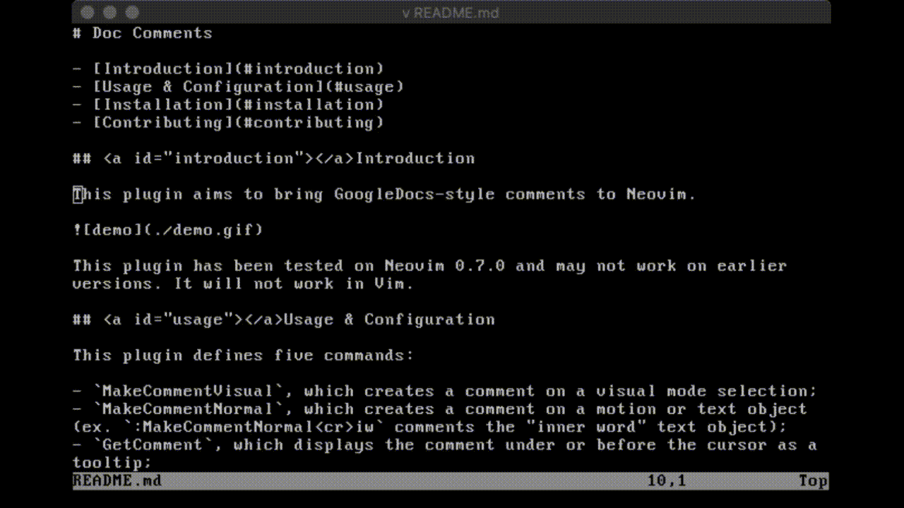

# Doc Comments

- [Introduction](#introduction)
- [Usage & Configuration](#usage)
- [Installation](#installation)
- [Contributing](#contributing)

## <a id="introduction"></a>Introduction

This plugin aims to bring GoogleDocs-style comments to Neovim.



It has only been tested in Neovim version 0.6.1 on Mac OS. It will not work in Vim.

## <a id="usage"></a>Usage & Configuration

This plugin defines three commands: `MakeComment`, `GetComment`, and `DeleteComment`. `MakeComment` is used in visual mode to add a comment to the selected text, `GetComment` gets the comment under or before the cursor, and `DeleteComment` deletes the comment under or before the cursor. Example mappings:

```
vnoremap c :MakeComment<cr>
nnoremap <leader>dc :DeleteComment<cr>
nnoremap <leader>gc :GetComment<cr>
```

This plugin does not remap any keys by default.

Comments are stored in a plaintext file in the same directory as the file they reference and are named according to the convention `.[name of original file]_comments`. This plugin should not create a comment file until you actually make a comment.

Doc Comments uses the following variables for customization: `g:DocCommentsHighlightGroup`, the highlight group for commented text (defaults to "Underlined"); `g:DocCommentsPreviewHeight`, the height of the window to display comments (defaults to 10); and `g:DocCommentsPreviewWidth`, the width of the window to display comments (defaults to 55).

## <a id="installation"></a>Installation

Install manually or use Vim-Plug:

```
Plug 'oxytocin/DocComments'
```

Other plugin managers will probably also work.

The python package `neovim` is also needed:

```
pip install neovim
```

Make sure you run `UpdateRemotePlugins` in neovim after.

## <a id="contributing"></a>Contributing

Open to suggestions; this is my first vim plugin, so I am sure there is room for improvement. Please submit issues for bugs. Pull requests are welcome.
