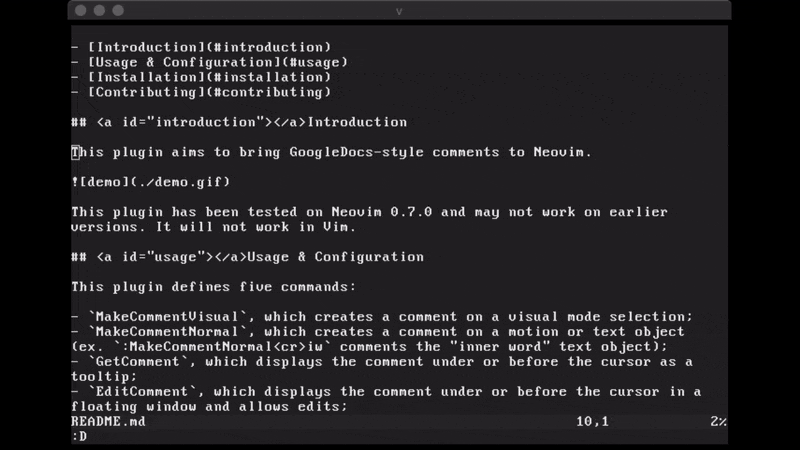

# Doc Comments

- [Introduction](#introduction)
- [Usage & Configuration](#usage)
- [Installation](#installation)
- [Contributing](#contributing)

## <a id="introduction"></a>Introduction

This plugin aims to bring GoogleDocs-style comments to Neovim.



This plugin has been tested on Neovim 0.7.0 and may not work on earlier versions. It will not work in Vim.

## <a id="usage"></a>Usage & Configuration

This plugin defines four commands: `MakeCommentVisual`, `MakeCommentNormal`, `GetComment`, and `DeleteComment`. `MakeCommentVisual` creates a comment on a visual selection, while `MakeCommentNormal` does the same but behaves like an operator. (For example, `:MakeCommentNormal<cr>iw` comments the "inner word" text object.) `GetComment` gets the comment under or before the cursor, and `DeleteComment` deletes the comment under or before the cursor. Example mappings:

```
vnoremap c :MakeCommentVisual<cr>
nnoremap yc :MakeCommentNormal<cr>
nnoremap <leader>dc :DeleteComment<cr>
nnoremap <leader>gc :GetComment<cr>
```

This plugin does not remap any keys by default.

> **NOTE**: The command `MakeComment` will behave like `MakeCommentVisual` to maintain backward compatibility with previous versions of this plugin, which only worked in visual mode.

Doc Comments uses the following variables for customization:

- `g:DocCommentsHighlightGroup`, the highlight group for commented text (defaults to "Underlined");
- `g:DocCommentsPreviewHeight`, the height of the window to display comments (defaults to 10);
- `g:DocCommentsPreviewWidth`, the width of the window to display comments (defaults to 55);
- `g:DocCommentsPath`, the path to store/look for comment files. By default, comment files will be stored in the same directory as the original file. Comment files are named according to the convention `.[name of original file]_comments`.

## <a id="installation"></a>Installation

Install manually or use Vim-Plug:

```
Plug 'oxytocin/DocComments', { 'do': 'UpdateRemotePlugins' } 
```

Other plugin managers will probably also work, but remember to run `UpdateRemotePlugins` after installing.

Requires the Python package `Neovim`:

```
pip install neovim
```

## <a id="contributing"></a>Contributing

Open to suggestions; this is my first vim plugin, so I am sure there is room for improvement. Please submit issues for bugs. Pull requests are welcome.
